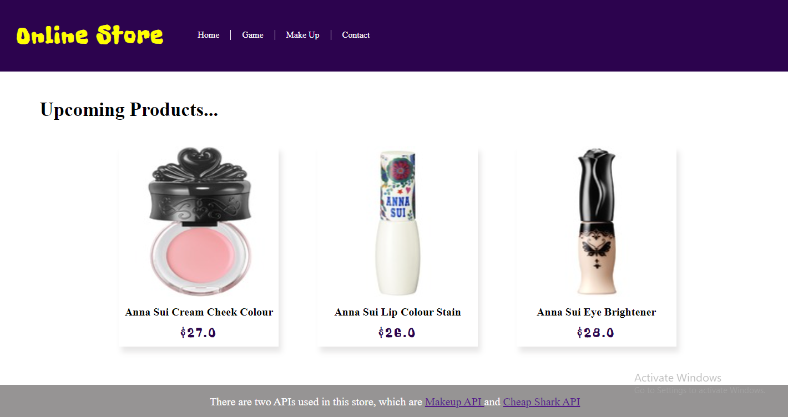
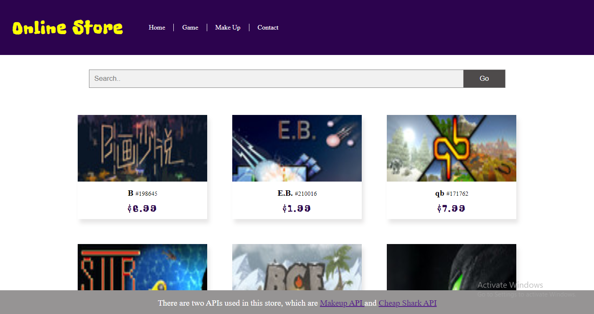

# Creative-Project
This is where I will post my creative project. If you have any good ideas,
feel free to contact me and we can discuss and make the project together.

* Resume_2021

I make my resume into a website in order to refresh my knowledge about **HTML** and **CSS**.
The webiste looks like the following picture. It does not look very good now, but I will
try to modify the color and the structure a bit to make the website look more nicely
someday.

* Game: What do you know about me?

This is a game I built using **HTML**, **CSS**, and **JavaScript**. The game has different
levels and the instructions are provided before starting the game. Feel free to clone it and
play it to test your knowledge about me. Note that some levels are still being developed, but you
can try the first level already!

* Online Store

Note: To able able to run this fake online store on your computer, after cloning the project,
you will also need to run `npm install express` and `npm install multer` in the terminal to install
all the modules needed for this project in the same folder as where you clone the project.

This is a fake online store I developed using **HTML**, **CSS**, and **JavaScript**. I collected
data by using the following API, [Makeup API](http://makeup-api.herokuapp.com/) and [CheapShark API](https://apidocs.cheapshark.com/).
The home page of the online store looks like the following picture.

You can also search game products and makeup products in online store.

Other than that, toward the end of May 2021, I have added the feature that the users are able to create account and login
with their email. I have also developed some API for others to collect information about my fake online store.

test

**For better readibity, I will seperate this page to multiple README.md file under the project file. I will start doing it next month, so stay tuned with that.**